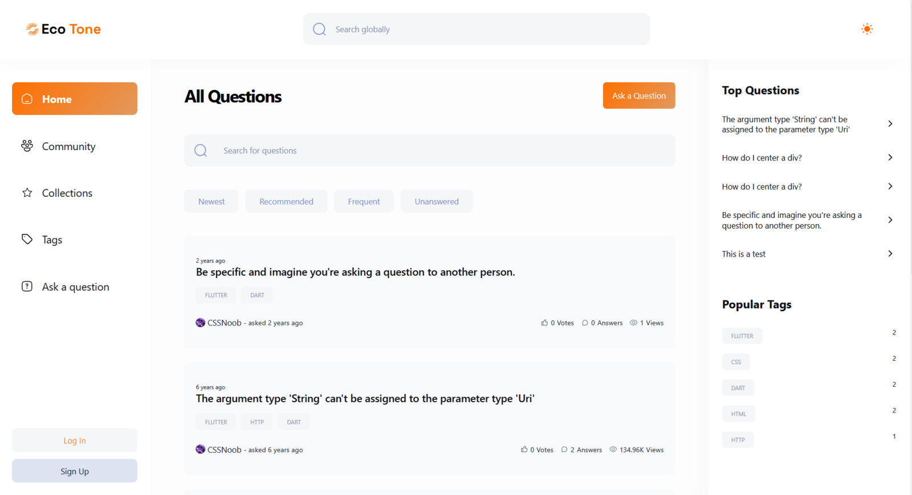
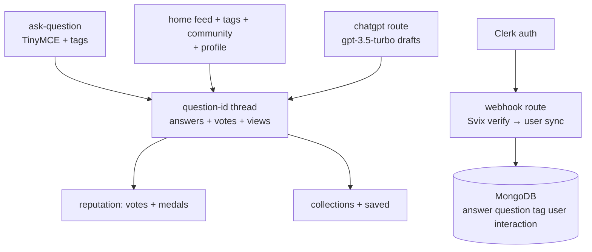

# Ecotone (Next Ecotone)

> StackOverflow-style Q&A community — TinyMCE authoring, votes and reputation, collections, and ChatGPT-drafted answers.

**Stack:** Next.js 14.0.2 · React 18 · Clerk 4 + Svix webhooks · Mongoose/MongoDB (5 models) · TinyMCE · ChatGPT via REST



| Fact | Evidence |
| --- | --- |
| Identity synced, not copied | Svix-verified Clerk webhook ingestion into `user` collection (`app/api/webhook/route.ts`) |
| 83 commits of community building | Auth → Mongoose models → webhook → votes → AI drafts → metadata/share hardening |
| AI without an SDK | `app/api/chatgpt/route.ts` calls `gpt-3.5-turbo` with raw `fetch` + `OPENAI_CHATGPT_API_KEY` |
| Share-hardened threads | OG/Twitter metadata passes plus an FB image fix (`edb795d`, `57ab77f`) |

## The Problem

Internal knowledge rots in chat scrollback. Teams need searchable questions with trustworthy ranking — votes, reputation, collections — where identity is consistent and threads read well when shared.

## The Solution

An App Router app where Mongo stores questions, answers, tags, users, and interactions; Clerk webhooks keep the `user` collection in sync with identity truth; a ChatGPT endpoint drafts answers for human review; votes, medals, views, and collections rank and organize content.



## Key Features

**Ask with rich authoring.** TinyMCE editor with tags and code content. Why it matters: technical questions need formatting that plaintext can't carry.

**Ranked threads.** Answer votes, views, medals, and collections. Why it matters: ranking is what separates knowledge from noise.

**AI answer drafts.** Prompt-POST drafts reviewers refine. Why it matters: drafts unblock answering; blank pages don't get answers.

**Webhook-synced identity.** Svix-verified ingestion keeps profiles and attribution consistent. Why it matters: forged or stale profiles poison trust.

**Share-ready threads.** OG/Twitter metadata with image-fallback fixes. Why it matters: knowledge shared without unfurls doesn't travel.

## Key Engineering Decisions

**Problem → Constraint → Decision → Tradeoff → Result**

1. **Profiles drifted from identity truth.** Constraint: client-created profiles can be forged or stale. Decision: Clerk webhook ingestion with Svix verification into `user`. Tradeoff: webhook endpoint to secure and monitor (400s on missing headers, throws on missing secret). Result: consistent attribution — route plus `svix` dep plus Clerk-loading fixes are the evidence.

2. **No OpenAI SDK.** Constraint: SDK churn vs. one endpoint's needs. Decision: raw `fetch` to `gpt-3.5-turbo` behind the app's own route. Tradeoff: manual request/response handling, no streaming helpers. Result: the smallest possible AI surface — one route, one key.

3. **Public vs. gated routes.** Constraint: feeds and tags should be browsable; asking must be authenticated. Decision: `authMiddleware` with explicit public paths (`/`, `/api/webhook`, `/tags…`, `/profile/:id`, `/community`). Tradeoff: public-route list to maintain per feature. Result: browsable community with a gated contribution path.

## Iteration Story

The 83-commit arc (richest community history in the portfolio): `create-next-app` → Clerk auth → Mongoose + User/Question/Tag models → webhook readiness → middleware public routes → votes components → answer votes → ChatGPT integration → recommendation logic → loading/toast passes → not-found and no-result states → OG/Twitter metadata → FB image fix. Identity → content → ranking → AI → shareability: each phase unlocked the next.

## User Experience

Browse the feed, tags, and community freely. Sign in to ask with the rich editor, answer threads, vote, save to collections, and follow profiles. Request an AI draft when stuck. Shared links unfurl with proper titles and images.

## Results & Evidence

**Verifiable:** webhook route, five models, chatgpt route, middleware public list, and the full 83-commit arc are committed and reviewable.

**Not claimed:** no tests or usage metrics are recorded.

## Technical Details

| Area | Detail |
| --- | --- |
| Framework | Next.js 14.0.2, React 18, Tailwind, `next-themes` |
| Auth | `@clerk/nextjs` 4 + `authMiddleware`; `svix` webhook verification |
| Data | `mongoose` + `mongodb` (`dbName: ecotone`); 5 models; `lib/actions/` ×7 |
| Editor/AI | `@tinymce/tinymce-react`, `prismjs` code highlighting, `react-hook-form` + `zod` |
| Secrets | `.env.example` (11 names: Clerk ×7, TinyMCE, `MONGODB_URL`, server URL, `OPENAI_CHATGPT_API_KEY`). Nothing committed. |

## Setup

1. **Prerequisites:** Node 18+, npm, MongoDB, Clerk, TinyMCE, OpenAI accounts.
2. **Clone and install:**
   ```bash
   git clone https://github.com/LowkeyGud/Next_ecotone.git
   cd Next_ecotone
   npm install
   ```
3. **Environment:** copy `.env.example` to `.env` and fill all names.
4. **External services:** Clerk app with its user-event webhook pointed at `<server-url>/api/webhook` (signing secret required); TinyMCE key with the domain allowlisted; OpenAI key.
5. **Database:** point `MONGODB_URL` at the cluster; Mongoose creates the five collections on first write.
6. **Run:**
   ```bash
   npm run dev
   ```
   Production: `npm run build` then `npm start`, with production webhook/server URLs set.
7. **Verify:** sign up (confirm `user` row appears), ask with code, answer, vote, save to a collection, request an AI draft.
8. **Common issues:** webhook 400 → signing-secret mismatch; blank TinyMCE → domain not allowlisted; AI failures → key quota/expiry; auth loops → after-auth URLs vs. middleware mismatch.

No CI workflow is committed in this repo.

## Lessons / Takeaways

- Webhook-synced identity was the trust foundation everything else (votes, profiles, attribution) stood on.
- Share metadata was late work with outsized value — knowledge that unfurls gets read.
- Next step is vote-fraud guardrails and AI-draft quality evaluation — both unmeasured today.

## Links

- Repository: `https://github.com/LowkeyGud/Next_ecotone`
- Live Demo: `https://next-ecotone.vercel.app`

## Diagrams

Generated from the codebase with the mermaid-skill workflow (validate via Kroki → export SVG → vision self-check). Sources live in `docs/diagrams/` — edit the `.mmd`, re-render, review. SVG is the committed format.

**Entity-relationship** (`docs/diagrams/er.mmd` — all 5 models, refs from `database/*.modal.ts`):



## Screenshots

Captured from the live deployment:


